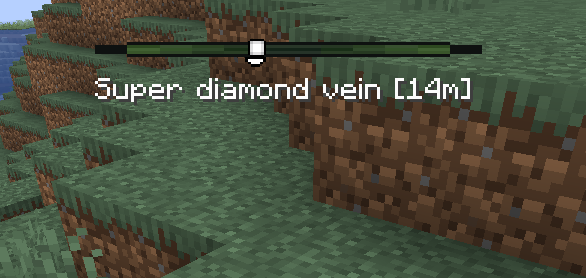
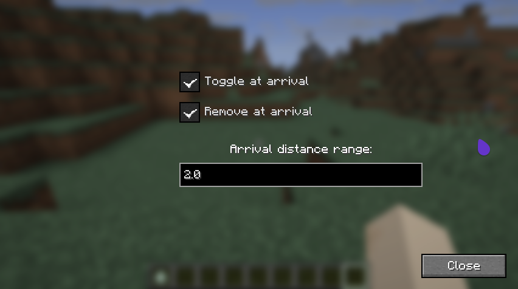

# Waypoints mod

## Info

This mod allows the players to add their waypoints and follow them with a centered top locator, including arrows indicating if the waypoint is above or below the player him/herself.

## Commands

- `/waypoint name` activates the waypoint called "name". If quoted, spaces might be used aswell.
- `/waypoint name x y z [world]` creates a new waypoint and, if world is the same of the current one, activates the waypoint itself. World is potional.
- `/waypoint list`
- `/waypoint delete [name]` removes a waypoint from the list. If the waypoint is the current one, or it's not specified, will also interrupt the navigation.

Options (they can be configured visually. The UI is triggered by `/waypoint` or via settings -> Mods -> Waypoint)
- `/waypoint range [new range]` sets the range at which the navigation ends. Argument is double.
- `/waypoint removeAfterReach true|false` if enabled, the current waypoint will be removed from the list once reached
- `/waypoint toggleAfterReach true|false` if enabled, the current waypoint will be disabled, but will be kept in the waypoints list

## Screenshots
Locator bar

Configuration screen

